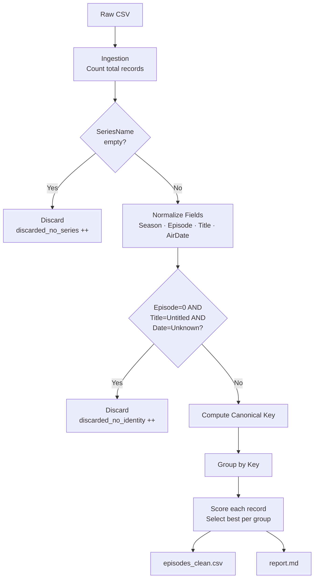

# FootprintTechnicalChallenge
Data quality pipeline to parse, normalize, and deduplicate a corrupted TV episode catalog.

# The Streaming Service's Lost Episodes

A data pipeline that parses, validates, deduplicates, and cleans a corrupted CSV catalog of streaming series episodes. Produces a clean output file and a data quality report.

---

## Problem Overview

A streaming platform digitized its catalog without applying validation or uniqueness constraints during ingestion. The resulting dataset contains missing fields, invalid formats, inconsistent values, and duplicate records across all five columns.

The pipeline restores the catalog to a consistent, deduplicated state while preserving traceability of every correction made.

---

## Processing Pipeline



| Phase | Description |
|-------|-------------|
| **Ingestion** | Read CSV row by row via `DictReader`. Track original line index for tiebreaking. |
| **Gate check** | Discard immediately if `SeriesName` is empty — no further processing is possible without a series identity. |
| **Normalization** | Apply field-level rules: coerce invalid numbers to `0`, replace empty titles with `"Untitled Episode"`, parse dates across multiple formats, default invalid dates to `"Unknown"`. |
| **Post-norm discard** | Discard if `EpisodeNumber=0`, `EpisodeTitle="Untitled Episode"`, and `AirDate="Unknown"` simultaneously — the record carries no usable identity. |
| **Deduplication** | Assign each record a canonical key based on which fields are known. Group by key, score each record, and keep the best one per group. |
| **Output** | Write clean CSV sorted by Series → Season → Episode. Write quality report with integrity check. |

---

## Design Decisions

**SeriesName as the mandatory gate.**
Without a series name there is no identity anchor — normalizing or grouping the record would be meaningless. It is discarded before any further processing.

**AirDate excluded from deduplication keys.**
If AirDate were part of the key, two records representing the same episode — one with a known date, one with `"Unknown"` — would not be recognized as duplicates. AirDate is used exclusively as a quality scoring criterion after grouping.

**Scoring system for best-record selection.**
The spec defines a priority order for resolving duplicates. Rather than a chain of conditionals, a numeric score (4 + 2 + 1) maps each criterion to a weight, making the logic explicit, flat, and easy to extend.

**Original casing preserved in output.**
The spec defines normalization (lowercase + trim + collapse spaces) for key comparison only. The output retains the casing of whichever record was selected as best — the data is cleaned, not rewritten.

**Edge case: Season = 0 and Episode = 0.**
The spec defines three canonical key types but does not cover the case where both are unknown. This pipeline extends the pattern consistently with `(series_norm, 0, 0, title_norm)`, treating records with the same normalized title in the same series as duplicates. This decision is documented in the quality report.

**Integrity check in the report.**
The report verifies: `total_input = total_output + discarded_no_series + discarded_no_identity + duplicates_removed`. A mismatch would indicate a logic error in the pipeline.

---

## Deduplication Strategy

Canonical key depends on which fields are known after normalization:

| Season | Episode | Key |
|--------|---------|-----|
| ≠ 0 | ≠ 0 | `(series_norm, season, episode)` |
| = 0 | ≠ 0 | `(series_norm, 0, episode, title_norm)` |
| ≠ 0 | = 0 | `(series_norm, season, 0, title_norm)` |
| = 0 | = 0 | `(series_norm, 0, 0, title_norm)` *(edge case)* |

When multiple records share the same key, the best record is selected by score:

| Criterion | Points |
|-----------|--------|
| Valid Air Date (not `"Unknown"`) | 4 |
| Known Title (not `"Untitled Episode"`) | 2 |
| Both Season and Episode non-zero | 1 |
| Tiebreaker | First occurrence in file |

---

## Requirements

- Python 3.10+ (`@dataclass(slots=True)` requires 3.10 or later)
- No external dependencies — standard library only

---

## How to Run

```bash
python episode_pipeline.py data/sample_input.csv
```

Output files are written to the current directory:

- `episodes_clean.csv` — cleaned and deduplicated catalog
- `report.md` — data quality report with integrity check and deduplication strategy

A sample input file is provided at `data/sample_input.csv` covering all edge cases described in this document.

---

## Conclusions & Limitations

**What the pipeline handles well:**
- All normalization rules defined in the spec, including multi-format date parsing and non-numeric coercion
- Duplicate resolution under partial information (missing season, missing episode, or both)
- Full traceability: every discarded or corrected record is counted and explained in the report

**Known limitations and assumptions:**
- **Date formats:** The parser covers the most common formats. Locale-specific or exotic formats would require extending `DATE_FORMATS`.
- **Title conflicts in duplicates:** When two records share the same key but have different non-default titles (e.g., `"Pilot"` vs `"El Piloto"`), the first-encountered record wins by tiebreaker. This is an unavoidable data loss scenario without external validation.
- **Encoding:** UTF-8 input is assumed. Non-UTF-8 files would require encoding detection (e.g., `chardet`).
- **Edge case (Season = 0, Episode = 0):** The spec does not define a key for this combination. The chosen approach is a reasoned extension of the existing pattern and would require validation against the upstream data source in a production context.